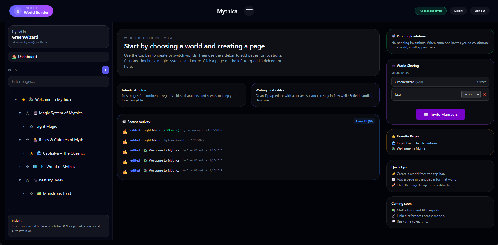
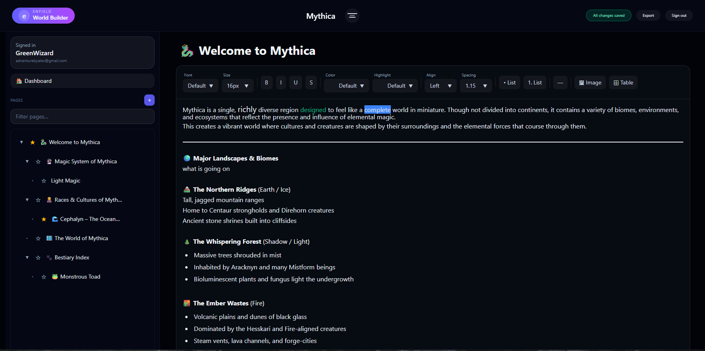
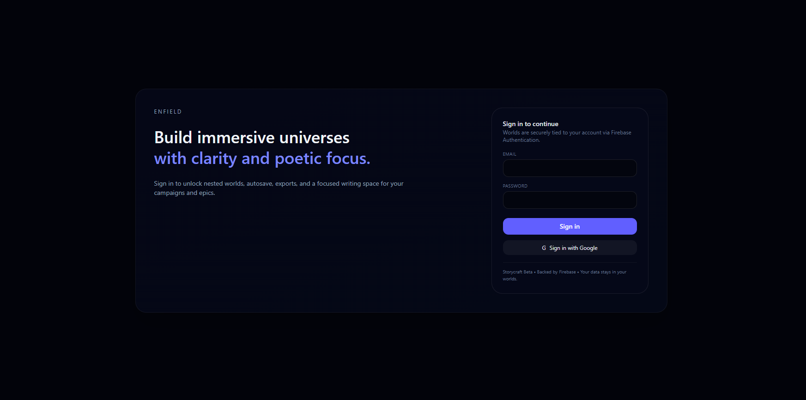

# Enfield World Builder

A powerful tool for building detailed fictional worlds, game campaigns, and creative projects. Create nested documents with rich text editing, share your worlds with others, and keep everything organized in one place.

## Live Demo

Try it out: **[https://world-builder-frontend.onrender.com/](https://world-builder-frontend.onrender.com/)**

> **Note:** The app is hosted on Render's free tier, so it may take 30-60 seconds to wake up on the first visit. Thanks for your patience!



## What It Does

Enfield helps you organize complex creative projects like fantasy worlds, game campaigns, story wikis, or any interconnected documentation. Think of it as a specialized notebook where you can:

- Create unlimited nested pages for locations, characters, timelines, and more
- Write and format content with a clean, distraction-free editor
- Share your worlds with collaborators and manage their permissions
- Export your work to PDF
- Never worry about losing progress with automatic saving



## Key Features

### Organization & Structure
- **Infinite nesting** - Create pages within pages as deep as you need
- **Drag-and-drop** - Reorganize your pages by dragging them around
- **Custom icons** - Give each page a unique emoji or icon
- **Favorites** - Star important pages for quick access
- **Search & filter** - Find any page quickly

### Rich Text Editor
- **Full formatting** - Bold, italic, underline, colors, highlights, and more
- **Lists & tables** - Organize information with bullet lists and tables
- **Images** - Upload and embed images with Cloudinary
- **Multiple fonts** - Choose from different font styles and sizes
- **Text alignment** - Left, center, right, and justified text
- **Slash commands** - Type "/" to quickly insert formatting

### Collaboration & Sharing
- **World sharing** - Invite others to view or edit your worlds
- **Role management** - Choose who can edit (Editor) or manage everything (Admin)
- **Email invitations** - Send invites directly from the app
- **User accounts** - Sign in with email/password or Google

### Other Features
- **Auto-save** - Changes save automatically as you work
- **Light & dark modes** - Switch themes based on your preference
- **Export to PDF** - Save your pages as PDF documents
- **Activity tracking** - See recent edits and changes
- **Mobile responsive** - Works on phones and tablets



## Getting Started

### What You'll Need

- Node.js 18 or newer
- pnpm 10+ (or npm)
- A MongoDB database (free tier from MongoDB Atlas works great)
- Firebase project (for authentication)
- Cloudinary account (for image uploads)

### Setup Instructions

1. **Clone the project**
```bash
git clone https://github.com/yourusername/world-builder.git
cd world-builder
```

2. **Install packages**
```bash
pnpm install
```

3. **Set up your services**

Create a `.env` file in the `apps/api` folder:
```
MONGODB_URI=your_mongodb_connection_string
PORT=3001
FIREBASE_PROJECT_ID=your_firebase_project_id
FIREBASE_CLIENT_EMAIL=your_firebase_client_email
FIREBASE_PRIVATE_KEY=your_firebase_private_key
CLOUDINARY_CLOUD_NAME=your_cloudinary_cloud_name
CLOUDINARY_API_KEY=your_cloudinary_api_key
CLOUDINARY_API_SECRET=your_cloudinary_api_secret
```

Create a `.env` file in the `apps/web` folder:
```
VITE_API_URL=http://localhost:3001
VITE_FIREBASE_API_KEY=your_firebase_api_key
VITE_FIREBASE_AUTH_DOMAIN=your_firebase_auth_domain
VITE_FIREBASE_PROJECT_ID=your_firebase_project_id
VITE_CLOUDINARY_CLOUD_NAME=your_cloudinary_cloud_name
VITE_CLOUDINARY_UPLOAD_PRESET=your_cloudinary_upload_preset
```

4. **Start the app**
```bash
pnpm dev
```

The app will open at `http://localhost:5173` with the API running at `http://localhost:3001`.

### Running Parts Separately

```bash
# Just the frontend
pnpm web

# Just the backend
pnpm api
```

## How It's Built

### Frontend
- **React 19** - Modern UI framework
- **TypeScript** - Type-safe code
- **Vite** - Fast development and builds
- **Tailwind CSS** - Easy styling
- **Tiptap** - Rich text editor
- **TanStack Router** - Page navigation
- **TanStack Query** - Data fetching and caching
- **Zustand** - Simple state management
- **dnd-kit** - Drag and drop functionality
- **Firebase** - User authentication
- **Cloudinary** - Image hosting

### Backend
- **Fastify** - Fast Node.js server
- **MongoDB** - Database
- **Firebase Admin** - Auth verification
- **Playwright** - PDF generation
- **Cloudinary** - Image management

### Project Organization
- **Turborepo** - Manages the monorepo and builds
- **pnpm workspaces** - Shared packages between frontend and backend
- **Shared types** - TypeScript types used across the whole project

## Project Structure

```
world-builder/
├── apps/
│   ├── web/              # React frontend
│   │   ├── public/       # Static files and images
│   │   └── src/          # Source code
│   └── api/              # Fastify backend
│       └── src/          # API code
├── packages/
│   └── types/            # Shared TypeScript types
└── turbo.json            # Monorepo configuration
```

## Building for Production

```bash
pnpm build
```

This builds both the frontend and backend for deployment.

## Coming Soon

Features we're planning to add:

- [ ] Multi-page PDF exports (export entire document trees)
- [ ] Linked references (see which pages reference each other)
- [ ] Real-time collaborative editing (see changes as others type)
- [ ] Document templates (start new pages with pre-made structures)
- [ ] Version history (view and restore previous versions)
- [ ] Advanced search with filters
- [ ] Block-level commenting

## Where to Deploy

Good hosting options for this app:

- **Frontend**: Vercel, Netlify, or Cloudflare Pages
- **Backend**: Railway, Render, or Fly.io
- **Database**: MongoDB Atlas (cloud-hosted)
- **Images**: Cloudinary
- **Auth**: Firebase

## Contributing

Found a bug or want to add a feature? Feel free to open an issue or submit a pull request!

## License

This project is open source under the MIT License.
